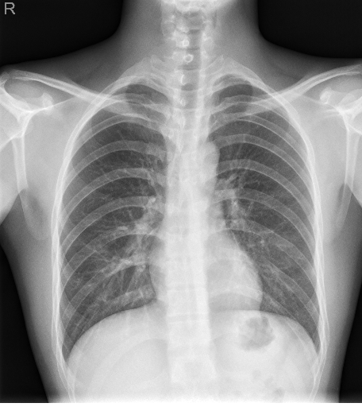
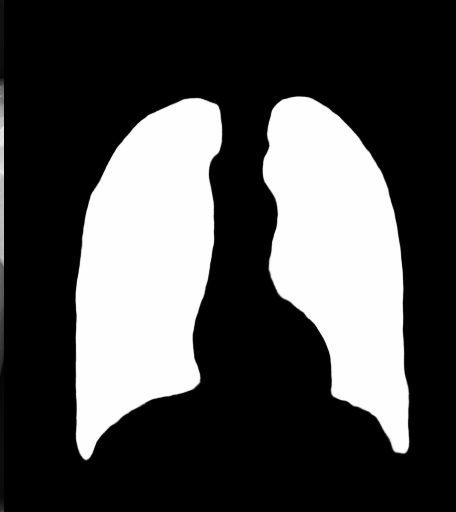
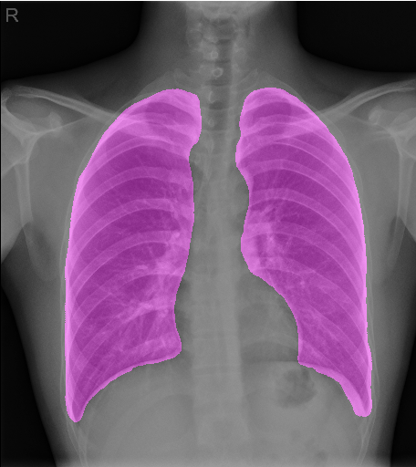
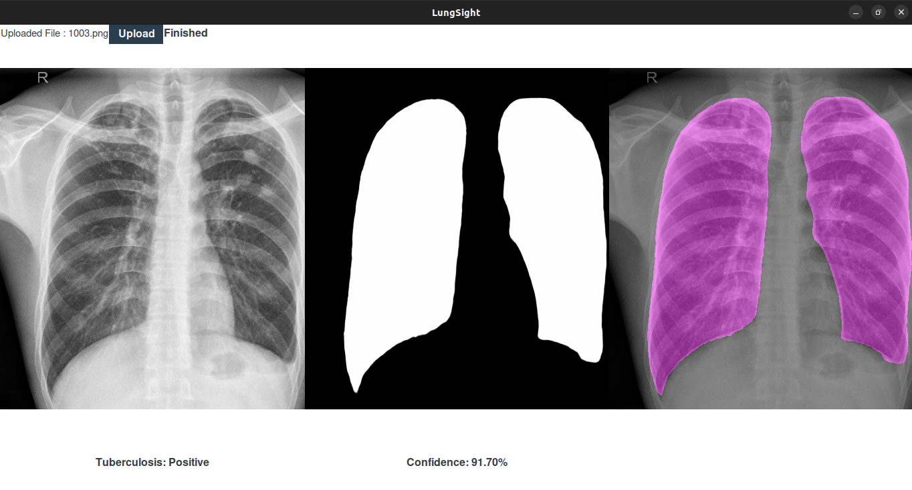

# **LungSight:** Tuberculosis Detection using Lung Segmentation and Image Classification

This is a desktop application for detecting **Tuberculosis (TB)** from chest X-ray images. The application uses a **Segmentation-Classification Pipeline** to first segment lung regions using an **Attention U-Net** model, and then classify the image using a CNN-based classifier.

## 🔍 Project Overview

- **Lung Segmentation:** Localizes the lung regions in an X-ray image.
- **Classification:** Predicts whether the X-ray indicates Tuberculosis (TB) or not.
- **Visualization:** Displays original, segmented, and overlayed images with prediction results and confidence.

## 📁 Project Structure

```

├── controller
│   └── MainController.py
├── view
│   ├── MainView.py
│   └── HomeView.py
├── model
│   ├── SegmentationModel.py
│   └── ClassificationModel.py
├── common_libs.py
├── resource
│   ├── segmentation_model.keras
│   ├── classification_model.keras
│   └── attention-u-net-lungs-segmentation-classification.ipynb
│
├── documentation
│   ├── ClassificationModel.html
│   ├── SegmentationModel.html
│   ├── MainView.html
│   ├── HomeView.html
│   ├── MainController.html
│   ├── common_libs.html
│   ├── main.html
│   ├── index.html
│   └── search.js
└── main.py

```

## 🚀 Getting Started

### Prerequisites

- Python 3.7+
- TensorFlow 2.x
- Pillow
- OpenCV
- NumPy
- Tkinter (included with most Python distributions)

### Installation

1. Clone the repository:

```bash
git clone https://github.com/iamtapendu/LungSight.git
cd LungSight
````

> **Note**: Make sure your segmentation and classification models (`.keras` or `.h5`) are saved inside the `resorce/` folder or correctly referenced in your code.
> **Download directly from this kaggle notebook output section [Link](https://www.kaggle.com/code/iamtapendu/attention-u-net-lungs-segmentation-classification)**

### Running the App

```bash
python main.py
```

This will launch a GUI window. Use the **Upload** button to select a chest X-ray image and view the results.

## 🖼️ App Preview

| Original Image                                        | Segmentation Mask               | Overlay                               |
|-------------------------------------------------------| ------------------------------- | ------------------------------------- |
|     |  |  |

## 🧠 Models Used

* **Segmentation Model:** Attention U-Net trained on lung X-ray masks
* **Classification Model:** CNN trained on segmented lungs and TB labels

## 📌 Features

* GUI built with Tkinter
* Real-time loading indicator
* File browsing and prediction
* Visual and textual feedback for predictions

## 📄 License

This project is licensed under the Apache 2.0 License. See the [LICENSE](LICENSE) file for details.

## 🙌 Acknowledgements

* Chest X-ray dataset
* U-Net / Attention U-Net architecture
* TensorFlow and Keras libraries
